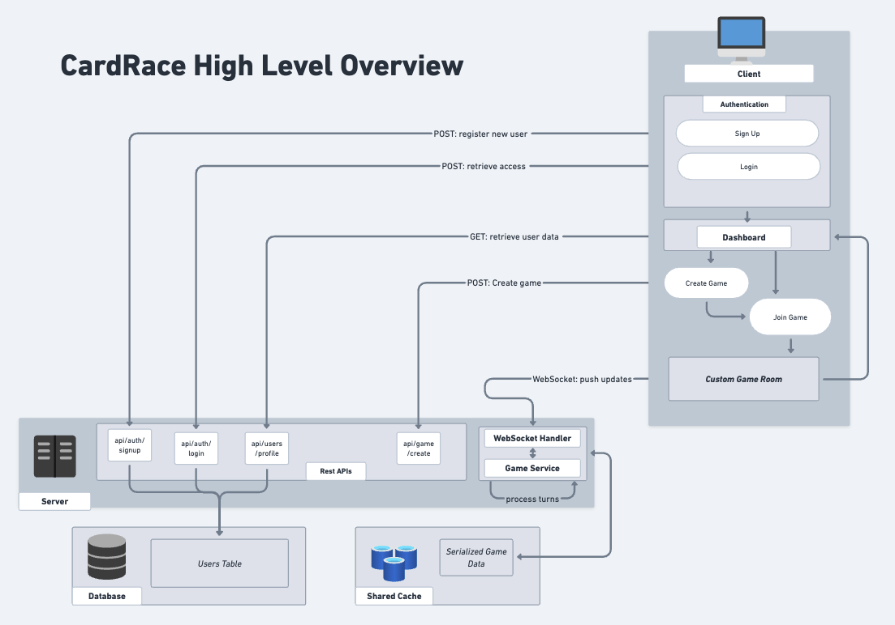
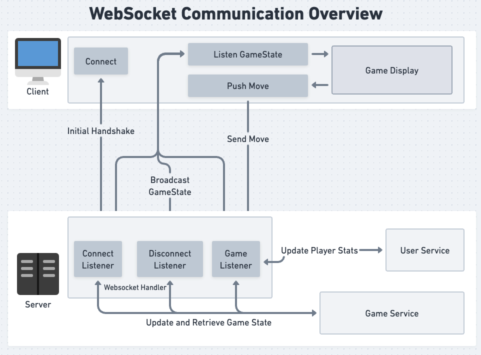

# Cardrace

Cardrace is an exciting board game that combines strategy, luck, and player interaction. 

## Table of Contents
1. [Game Overview](#game-overview)
2. [Project Architecture](#project-architecture)
3. [Installation](#installation)
7. [Contributing](#contributing)
8. [License](#license)

## Game Overview

Cardrace is a multiplayer board game where players compete to be the first to move all their marbles from their reserve, around the board, and into their safe zone. The game combines strategic decision-making with the element of chance introduced by card draws. Players use cards to move their marbles around the board, aiming to be the first to get all their marbles into their safe zone.

For detailed gameplay rules, including card values and special abilities, please refer to the [Official Rules and Gameplay](gameplay.md) document.

## Project Architecture

Cardrace is built using a modern, scalable architecture:

- **Frontend**: NextJS, PixiJS, Tailwind, Shadcn UI
- **Backend**: Spring Boot, netty-socket
    - [cardrace-server](https://github.com/zohaib-a-ahmed/cardrace-server)
- **Data Storage**:
  - Redis for game state management
  - DynamoDB for persistent data storage

### Diagrams

  

  ---

  

## Installation

To set up the Cardrace development environment locally, follow these steps:

1. Clone the server repository:
   ```
   git clone https://github.com/zohaib-a-ahmed/cardrace-server.git
   cd cardrace-server
   ```

2. Install Docker if you haven't already. 

3. Set up Redis using the official Docker image:
   ```
   docker run --name cardrace-redis -p 6379:6379 -d redis
   ```

4. Set up DynamoDB local using the official Docker image:
   ```
   docker run --name cardrace-dynamodb -p 8000:8000 -d amazon/dynamodb-local
   ```

5. Update the `application.properties` file in the Spring Boot project to point to these local instances:
   ```
   spring.redis.host=localhost
   spring.redis.port=6379
   amazon.dynamodb.endpoint=http://localhost:8000
   ```

7. Clone this repository:
   ```
   git clone https://github.com/your-username/cardrace-frontend.git
   cd cardrace-frontend
   ```

Now you should have the application running locally for development.

## Running the Game

After completing the installation steps:

1. Start the Redis and DynamoDB containers if they're not already running:
   ```
   docker start cardrace-redis
   docker start cardrace-dynamodb
   ```

2. Run the Spring Boot backend:
   ```
   cd cardrace-server
   mvn install
   mvn spring-boot:run
   ```

3. In a separate terminal, run the NextJS frontend:
   ```
   cd cardrace-frontend
   npm install
   npm run dev
   ```

4. Open your browser and navigate to `http://localhost:3000`.

## Contributing

We welcome contributions to Cardrace! Here's how you can contribute:

1. Fork the repository
2. Create your feature branch (`git checkout -b feature/AmazingFeature`)
3. Commit your changes (`git commit -m 'Add some AmazingFeature'`)
4. Push to the branch (`git push origin feature/AmazingFeature`)
5. Open a Pull Request

Please make sure to adhere to the existing coding style with javadoc-typed annotations to code.

For major changes, please open an issue first to discuss what you would like to change. Please make sure to update tests as appropriate.

## License

This project is licensed under the MIT License - see the [LICENSE.md](LICENSE.md) file for details.

```
MIT License

Copyright (c) [year] [fullname]

Permission is hereby granted, free of charge, to any person obtaining a copy
of this software and associated documentation files (the "Software"), to deal
in the Software without restriction, including without limitation the rights
to use, copy, modify, merge, publish, distribute, sublicense, and/or sell
copies of the Software, and to permit persons to whom the Software is
furnished to do so, subject to the following conditions:

The above copyright notice and this permission notice shall be included in all
copies or substantial portions of the Software.

THE SOFTWARE IS PROVIDED "AS IS", WITHOUT WARRANTY OF ANY KIND, EXPRESS OR
IMPLIED, INCLUDING BUT NOT LIMITED TO THE WARRANTIES OF MERCHANTABILITY,
FITNESS FOR A PARTICULAR PURPOSE AND NONINFRINGEMENT. IN NO EVENT SHALL THE
AUTHORS OR COPYRIGHT HOLDERS BE LIABLE FOR ANY CLAIM, DAMAGES OR OTHER
LIABILITY, WHETHER IN AN ACTION OF CONTRACT, TORT OR OTHERWISE, ARISING FROM,
OUT OF OR IN CONNECTION WITH THE SOFTWARE OR THE USE OR OTHER DEALINGS IN THE
SOFTWARE.
```

---

For more information about the game rules and technical details, please refer to the documentation in the `docs` folder.
